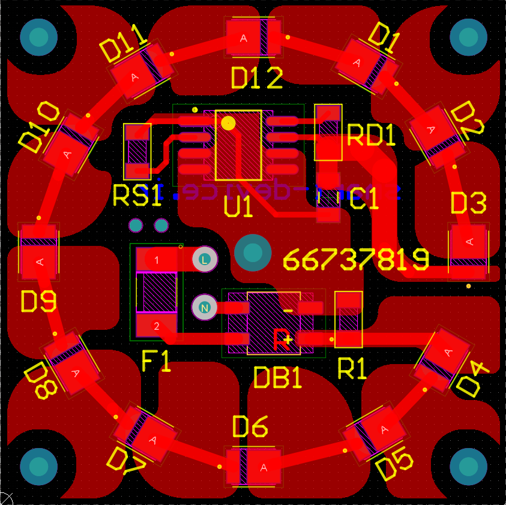

# CYT1001AG SMD LED DOB PCB
5W SMD LED DOB using CYT1001AG High PF Linear Constant Current LED Driver IC chip to drive 2835 18V LEDs 

Schematic from [manufacturer datasheet](https://github.com/smart-device/CYT1001AG-SMD-LED-DOB-PCB/blob/main/CYT1001AG.pdf)

PCB Designed in Altium Designer

PCB3D View

It can be used to build a DIY low power but efficient lamp.
